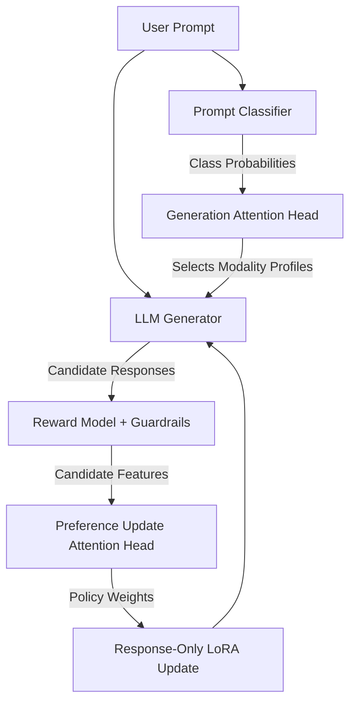

<div align="center">
  
# Multi-Modal GRPO with Two-Head Attentions

[](https://opensource.org/licenses/MIT)
[](https://www.python.org/downloads/)
[](https://pytorch.org/)
[](https://huggingface.co/)

An enterprise-grade implementation of **Group Relative Policy Optimization (GRPO)** using a novel non-invasive two-head attention routing mechanism for Multi-Modal LLM generation.

</div>

## 📌 Overview

Traditional prompt engineering and prompt injection methods alter the text the LLM sees, which can cause out-of-distribution hallucinations or prompt leakage. **MGRPO (Multi-Modal GRPO)** solves this by using a strictly non-invasive router. The user prompt is never modified.

Instead, the model leverages two specialized, independently trained Multi-Head Attention components:
1. **Classifier Prompt Generation Attention**: Attends to the probability distribution of a classifier and selects a set of generation profiles (temperature, top-p, penalties) to use.
2. **User Preference Update Attention**: Attends to the candidate responses using a Reward Model, dynamically weighting which candidates should drive the LoRA policy update.

## 🏗️ Architecture



## 🚀 Key Features

* **Non-Invasive Modality Routing**: No prompt prefixes, no hidden text injection. The LLM processes only the raw user prompt.
* **Dual Attention Mechanism**: Small, continuously trained attention heads that decouple generation heuristics from preference updates.
* **Response-Only Policy Update**: The gradient is strictly applied to response tokens; prompt tokens are masked to avoid imitating the prompt structure.
* **Robust Guardrails**: Integrated penalties for repetitive generation, empty outputs, or prompt leakage.
* **Enterprise Ready**: Modular package structure, `pyproject.toml` dependency management, and GitHub Actions CI pipeline.

## 📦 Installation

We recommend using a virtual environment:

```bash
# Clone the repository
git clone https://github.com/newabdennour/Multi-Modal-GRPO-with-two-head-attentions.git
cd Multi-Modal-GRPO-with-two-head-attentions

# Install the package and dependencies
pip install -e .
```

## 💻 Usage

Ensure you have your prompts dataset placed at `prompts.jsonl`. If omitted, the system will fall back to a dummy dataset for smoke testing.

To run the full training pipeline:

```bash
python src/main.py
```

To run a fast smoke-test (useful for debugging your local environment without downloading massive LLM weights fully):

```bash
python src/main.py --smoke-test
```

### Expected Outputs

The pipeline generates several artifacts in the `two_head_attention_grpo_lora/` directory:
- Safetensor checkpoints of the LLM generator model at specified intervals.
- The associated tokenizer files.

You will also see a live tracking report comparing the traditional GRPO baseline against the NOVEL Two-Head Attention GRPO pipeline.

## 🧪 Testing

To run the unit tests, install the development dependencies and run `pytest`:

```bash
pip install -e .[dev]
pytest tests/
```

## 📖 Project Structure

```text
Multi-Modal-GRPO-with-two-head-attentions/
├── notebooks/                # Jupyter notebooks for interactive exploration
├── src/
│   ├── mgrpo/
│   │   ├── data/             # Dataset loading and formatting
│   │   ├── models/           # Attention heads and Generator definitions
│   │   ├── rl/               # Reward models, guardrails, and policy loss
│   │   ├── training/         # Routing logic and training loops
│   │   ├── config.py         # Global hyperparameter configurations
│   │   └── utils/            # Tracking and statistics
│   └── main.py               # Main CLI entrypoint
├── tests/                    # Unit tests
├── pyproject.toml            # Python package metadata
└── README.md
```

## 📜 License

This project is licensed under the MIT License - see the [LICENSE](LICENSE) file for details.
